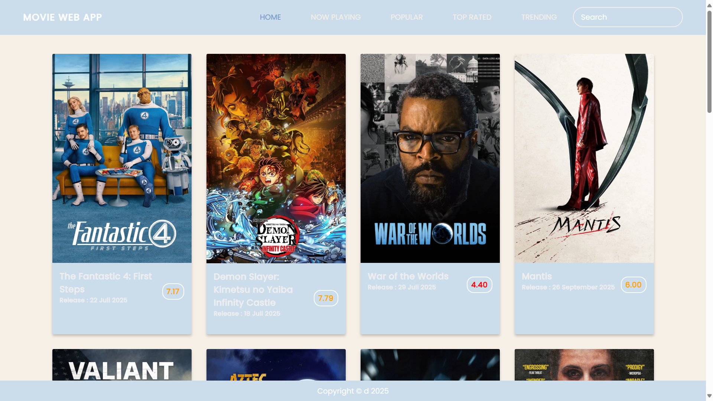

# 🎬 Movie Web App
This project was created as part of the **Frontend Project Course - Creating Movie App** on MySkill using HTML, CSS, and JavaScript. The application displays a list of movies retrieved from an API, allows users to search for movies by title, and shows detailed information when a movie is selected.

## 📸 Preview

